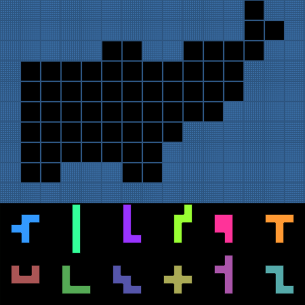
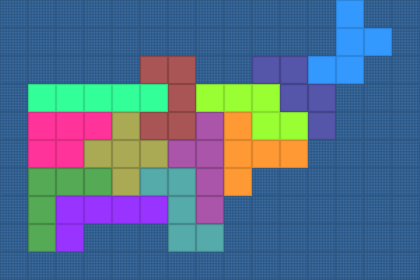
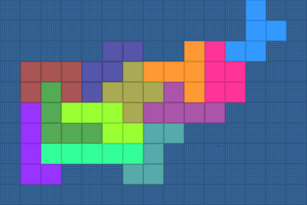
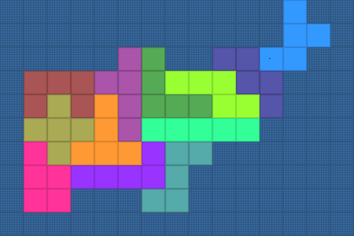
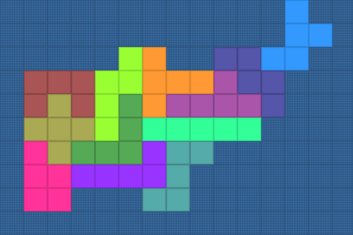

# Pentomino Puzzle Solver
The purpose of this project was to solve level 42 of the [Pentomino Puzzle Game](https://play.google.com/store/apps/details?id=kr.junojeong.android.pentomino) app. The empty squares on the board must be filled using each of the 12 [pentominos](https://en.wikipedia.org/wiki/Pentomino) exactly once. The pentominos are allowed to be rotated and flipped.

I had been stuck on this level for well over a year and decided to try my hand at finding a solution programmatically. I came across [this PDF](http://www.cs.brandeis.edu/~storer/JimPuzzles/PACK/Pentominoes/LINKS/PentominoesNivasch.pdf) which explains that these puzzles are equivalent to the [exact cover problem](https://en.wikipedia.org/wiki/Exact_cover#Pentomino_tiling) and details the algorithm used to solve it. The algorithm itself is quite intuitive, but the implementation proved trickier than expected.

I ended up typing in every possible position for every possible piece by hand, a task which was accomplished in about a week. After that my code took about 24 hours to process almost every possible position and came up with the following three solutions:  

# Algorithm X
Donald Knuth published a paper in 2000 titled [Dancing Links](https://arxiv.org/pdf/cs/0011047.pdf) in which he describes a doubly-linked torus data structure and an algorithm he named Algorithm X for solving this problem. It replaces the expensive operations of removing and reinserting rows and columns into the matrix with simple asymmetrical pointer operations. Thus backtracking simply involves pointer assignments rather than shifting the entire matrix.

Implementing this approach improved the performance of the code by a factor of 500000, reducing the runtime to about 0.167 seconds. At this speed it's trivial to check every possible solution, so I discovered a fourth and final solution which is only a minor variation of the third solution:

# Usage
* `make run`

